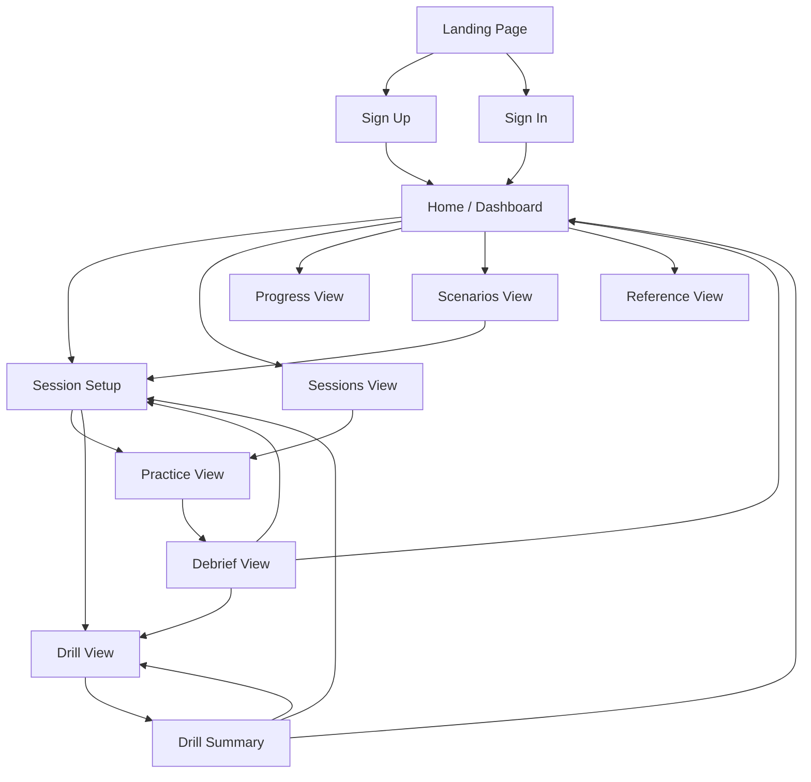
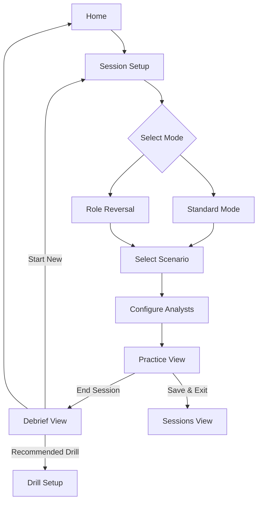
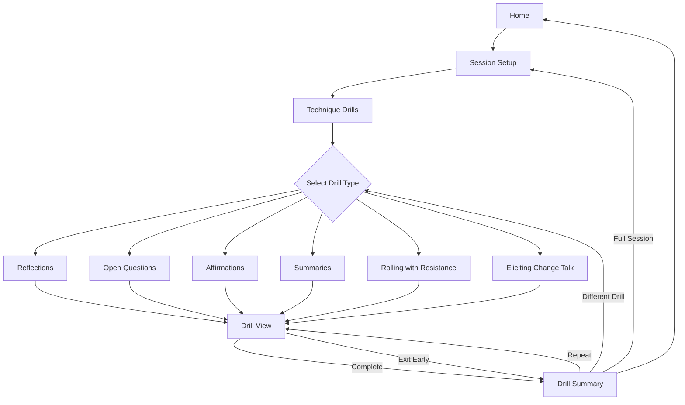
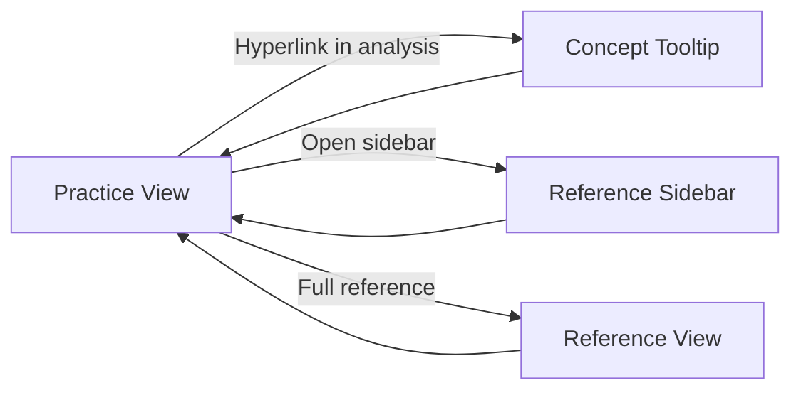

# MI Trainer - UX Design

Screens, flows, and interface concepts for the MI Trainer application.

## Screens

### Public (Unauthenticated)

**Landing Page**
- Introduction to the tool and its purpose
- "What is MI" section with brief explanation and links to external resources
- Feature highlights
- Sign up / sign in calls to action

**Sign Up**
- Account creation form
- Link to sign in

**Sign In**
- Authentication form
- Link to sign up
- Password recovery

### Authenticated

**Home / Dashboard**
- Quick actions: start new session, continue recent session
- Recent sessions list
- Progress snapshot (quick stats)
- Suggested scenarios or drills

**Session Setup**
- Mode selection (Standard, Role Reversal, Technique Drills)
- Scenario selection (built-in, user-created, generate new)
- Configuration options:
  - Which analysts are active
  - Automatic vs on-demand feedback
  - Interviewer skill level (Role Reversal only)

**Practice View**
- Two-pane layout with locked scrolling:
  - Left: Conversation thread (messages from user and client/interviewer)
  - Right: Analysis panel (Technique Analyst and Response Analyst output)
- Input area at bottom
- Controls: hint, rewind, branch navigation, reference access, end session
- Reference concepts hyperlinked in analysis text (open sidebar or tooltip)

**Drill View**
- Compact, focused interface for rapid-fire practice
- Prominent display of client statement/prompt
- Input field for user response
- Immediate feedback on submission (focused on the drill's target technique)
- "Next" action to advance
- Running score/streak display
- Drill controls: pause, end drill
- Optional timer mode

**Debrief View**
- Session summary and key statistics
- Technique Analysis section
- Response Analysis section
- Key moments with timestamps/links back to conversation
- Recommended drills based on areas for growth
- Export/share options
- Return to home or start new session

**Drill Summary**
- Drill completion statistics (count, accuracy, types)
- Strengths identified
- Areas to focus on
- Option to repeat drill, try different drill, or return home

**Progress View**
- MI adherence trend over time
- Technique usage breakdown and trends
- Client movement correlation data
- Drill performance by technique type
- Filterable by time period, mode, scenario type

**Reference View**
- Browsable/searchable MI concepts and techniques
- Core concepts section
- Technique reference section
- Can be accessed standalone or as sidebar during practice

**Scenarios View**
- Browse built-in scenarios (filterable by domain, resistance level)
- User-created scenarios list
- Generate new scenario from description
- Scenario detail view (preview before selecting)

**Sessions View**
- List of saved sessions with metadata (date, scenario, mode, progress)
- Filter/sort options
- Resume session (returns to Practice View)
- Review session (read-only, with debrief)
- Delete session

**Profile / Settings**
- Account information
- Preferences (default analyst settings, theme, etc.)
- Session history statistics
- Account management (password change, delete account)

## Flows

### Primary User Journeys



### Practice Session Flow



### Drill Flow



### Reference Access



## Interface Concepts

### Practice View Layout

```
┌─────────────────────────────────────────────────────────────────┐
│  [Scenario Name]                    [Hint] [Rewind] [Ref] [End] │
├────────────────────────────────┬────────────────────────────────┤
│                                │                                │
│  Conversation                  │  Analysis                      │
│                                │                                │
│  Client: [message]             │  Technique Analyst             │
│                                │  ────────────────              │
│  You: [message]                │  Techniques: reflection,       │
│                                │  open question                 │
│  Client: [message]             │                                │
│                                │  + Good empathic listening     │
│  ↙ ↘ [branch indicator]        │  - Advice without permission   │
│                                │  > Try reflecting ambivalence  │
│  You: [message]                │                                │
│                                │  Response Analyst              │
│  Client: [message]             │  ────────────────              │
│                                │  Change talk: Desire           │
│                                │  "I want to feel better"       │
│                                │                                │
│  [locked scroll]               │  [locked scroll]               │
│                                │                                │
├────────────────────────────────┴────────────────────────────────┤
│  > [input field]                                       [Send]   │
└─────────────────────────────────────────────────────────────────┘
```

### Drill View Layout

```
┌─────────────────────────────────────────────────────────────────┐
│  Reflections Drill                          12/20    ● ● ● ○ ○  │
├─────────────────────────────────────────────────────────────────┤
│                                                                 │
│                                                                 │
│  Client says:                                                   │
│                                                                 │
│  "I know I should probably cut back on drinking, but it's the   │
│   only way I can unwind after work. My wife keeps nagging me    │
│   about it which just makes me want to drink more."             │
│                                                                 │
│                                                                 │
├─────────────────────────────────────────────────────────────────┤
│                                                                 │
│  Reflect this statement:                                        │
│                                                                 │
│  > [input field]                                                │
│                                                                 │
│                                                     [Submit]    │
│                                                                 │
└─────────────────────────────────────────────────────────────────┘

[After submission - feedback appears]

┌─────────────────────────────────────────────────────────────────┐
│  Reflections Drill                          13/20    ● ● ● ● ○  │
├─────────────────────────────────────────────────────────────────┤
│                                                                 │
│  Your response:                                                 │
│  "Drinking helps you decompress, and the pressure from your     │
│   wife is making it harder, not easier."                        │
│                                                                 │
│  ✓ Complex reflection - captured both sides of the tension      │
│                                                                 │
│  This reflection acknowledges the function alcohol serves       │
│  while also reflecting the resistance to external pressure.     │
│  Double-sided reflections like this honor ambivalence.          │
│                                                                 │
│                                                       [Next]    │
│                                                                 │
└─────────────────────────────────────────────────────────────────┘
```

## Small Screen Adaptation

On smaller screens (mobile, narrow windows), the side-by-side Practice View layout may not work well. Options to explore:

**Tab-based**
- Conversation and Analysis as separate tabs
- User switches between them
- Badge/indicator when new analysis is available

**Pull-up panel**
- Conversation is primary view
- Analysis in a pull-up/slide-up panel from bottom
- Can be pinned open or dismissed

**Inline expansion**
- Analysis appears inline after each exchange
- Collapsible to reduce noise
- Similar to how some chat apps show reactions or threads

The right approach likely depends on testing. The core constraint is that both conversation and analysis need to be accessible without losing context.

## Branch Navigation

Branch points in the conversation tree need clear visualization and navigation. Current approaches in LLM chat apps typically use subtle left/right arrows beneath branched messages.

Areas to explore:
- Timeline/scrubber showing branch points
- Tree visualization (minimap or full view)
- Breadcrumb trail showing path through tree
- "Versions" concept similar to document version history

This is an area that may benefit from prototyping and user testing to find the most intuitive approach.

## Hyperlinked Reference

When analysis agents reference MI concepts, those references should be interactive:

- Concept names are styled as hyperlinks
- Clicking/tapping opens a tooltip or sidebar with the concept definition
- Option to "read more" navigates to full Reference View
- Works in both real-time analysis and debrief

This keeps users in flow while making learning resources immediately accessible.
